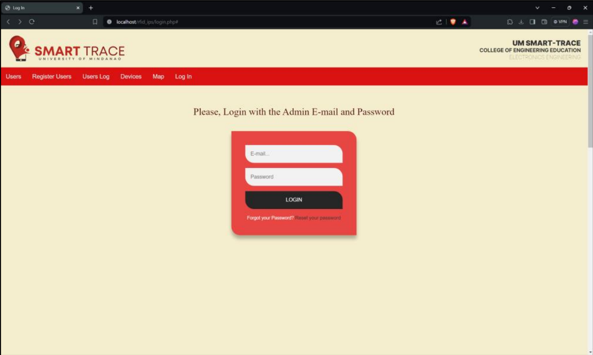
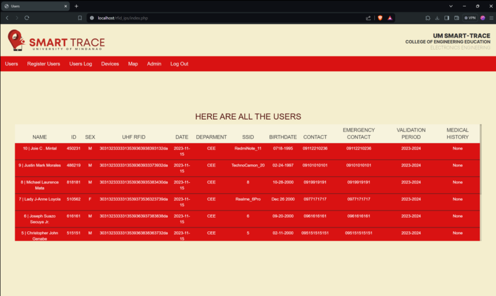
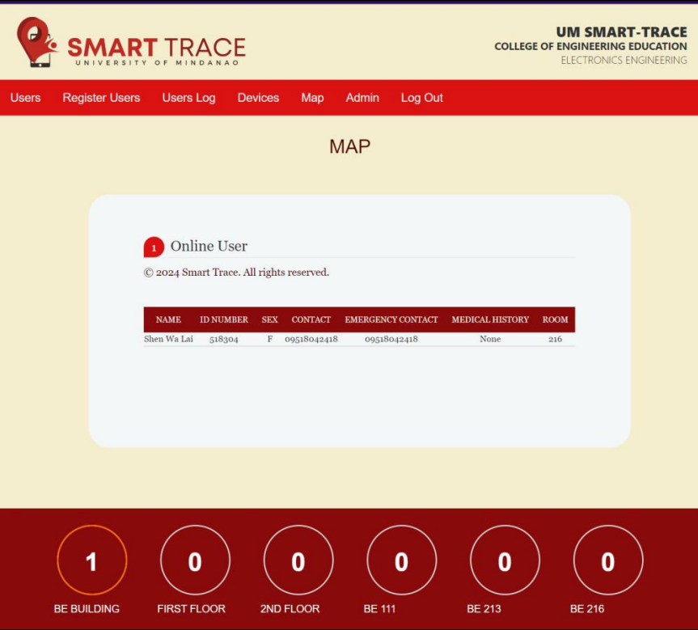
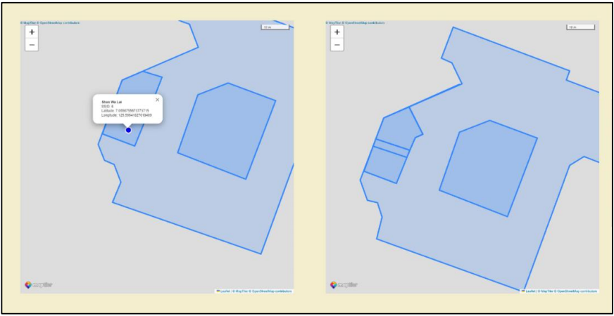
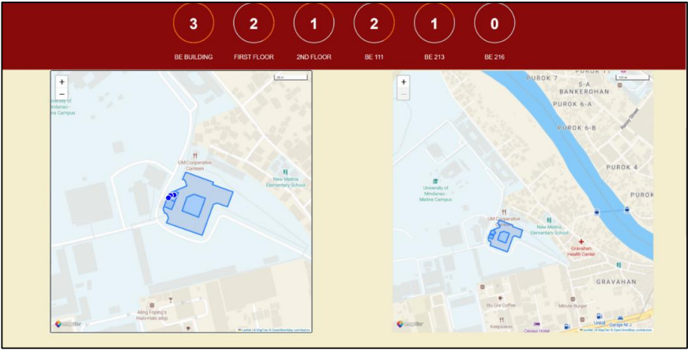

# UHF RFID Sticker System

A comprehensive web-based management system for tracking and managing UHF RFID sticker-based attendance and user information. This system is designed for the **College of Engineering Education, Electronics Engineering** department to efficiently manage users, devices, and attendance logs.


## 📋 Table of Contents

- [Features](#features)
- [Screenshots](#screenshots)
- [Requirements](#requirements)
- [Installation](#installation)
- [Configuration](#configuration)
- [Usage](#usage)
- [Database Structure](#database-structure)
- [File Structure](#file-structure)
- [Security Notes](#security-notes)
- [Contributing](#contributing)
- [License](#license)

## ✨ Features

### User Management
- **Add/Update/Remove Users**: Complete CRUD operations for user management
- **User Information**: Store name, ID number, email, gender, and department
- **Sticker Color Management**: Assign and track different colored RFID stickers (Yellow, Orange, Red, White, Blue, Green)
- **UHF RFID Card Association**: Link UHF RFID cards to users for attendance tracking

### Device Management
- **Multi-Device Support**: Manage multiple RFID reader devices
- **Department-Based Organization**: Assign devices to specific departments
- **Device Configuration**: Configure device names, UIDs, and operational modes

### Attendance & Logging
- **Real-Time Logging**: Automatic time-in and time-out tracking via RFID stickers
- **Daily Logs View**: View user attendance logs with date and time information
- **Advanced Filtering**: Filter logs by:
  - Date range (start and end dates)
  - Time range (time-in or time-out)
  - Specific user (by RFID card)
  - Device department
- **Auto-Refresh**: Logs automatically update every 5 seconds

### Data Export
- **Excel Export**: Export filtered attendance logs to Excel format (.xls)
- **Customizable Filters**: Apply multiple filters before exporting

### Admin Features
- **Secure Authentication**: Admin login with email and password
- **Password Reset**: Password recovery functionality
- **Account Management**: Update admin profile information
- **Session Management**: Secure session-based authentication

## 📸 Screenshots

### Login Page


### User Management


### System Maps






## 🔧 Requirements

- **Web Server**: Apache 2.4+ or Nginx
- **PHP**: Version 7.3 or higher
- **Database**: MySQL 5.7+ or MariaDB 10.1+
- **PHP Extensions**:
  - mysqli
  - session
  - mbstring
- **Browser**: Modern browsers (Chrome, Firefox, Safari, Edge)

## 🚀 Installation

### Step 1: Clone the Repository

```bash
git clone https://github.com/reyden142/UHF_RFID_sticker_system.git
cd UHF_RFID_sticker_system
```

### Step 2: Database Setup

1. Create a MySQL database:
   ```sql
   CREATE DATABASE UHF_RFID_STICKER;
   ```

2. Import the database schema:
   ```bash
   mysql -u root -p UHF_RFID_STICKER < UHF_RFID_STICKER.sql
   ```
   
   Or use phpMyAdmin:
   - Open phpMyAdmin
   - Select the `UHF_RFID_STICKER` database
   - Go to Import tab
   - Choose `UHF_RFID_STICKER.sql` file and click Go

### Step 3: Configure Database Connection

Edit `connectDB.php` and update the database credentials:

```php
$servername = "localhost";
$username = "root";        // Your MySQL username
$password = "";            // Your MySQL password
$dbname = "UHF_RFID_STICKER";
```

### Step 4: Set Up Web Server

#### For Apache:
1. Copy the project folder to your web server directory (e.g., `htdocs` or `www`)
2. Ensure mod_rewrite is enabled
3. Set proper file permissions

#### For XAMPP/WAMP:
1. Copy the project folder to `C:\xampp\htdocs\` (Windows) or `/opt/lampp/htdocs/` (Linux)
2. Access via: `http://localhost/UHF_RFID_sticker_system/`

### Step 5: Default Admin Credentials

After importing the database, you can log in with:
- **Email**: `admin@gmail.com`
- **Password**: Check the database or use the password reset feature

**⚠️ Important**: Change the default admin password immediately after first login!

## ⚙️ Configuration

### Database Configuration
- Edit `connectDB.php` to match your database settings
- Ensure the database name matches: `UHF_RFID_STICKER`

### Timezone Configuration
The system uses `Asia/Manila` timezone. To change it:
- Update timezone settings in `UsersLog.php` and related files
- Configure PHP timezone in `php.ini`:
  ```ini
  date.timezone = "Asia/Manila"
  ```

### Session Configuration
- Session settings can be modified in `php.ini`
- Default session timeout can be adjusted in PHP configuration

## 📖 Usage

### Admin Login
1. Navigate to `login.php`
2. Enter admin email and password
3. Click "Login"

### Managing Users
1. Go to **Manage Users** from the navigation menu
2. **Add User**:
   - Fill in user information (name, ID number, email)
   - Select department
   - Choose gender
   - Select sticker color
   - Click "Add User"
3. **Update User**: Select user from table, modify information, click "Update User"
4. **Remove User**: Select user from table, click "Remove User"

### Managing Devices
1. Go to **Devices** from the navigation menu
2. Click "New Device" button
3. Enter device name and department
4. Click "Create new Device"

### Viewing Attendance Logs
1. Go to **Users Log** from the navigation menu
2. View real-time attendance logs
3. Use **Log Filter/Export to Excel** button to:
   - Filter logs by date, time, user, or department
   - Export filtered results to Excel

### Exporting Data
1. Navigate to **Users Log**
2. Click "Log Filter/Export to Excel"
3. Apply desired filters
4. Click "Export" to download Excel file

## 🗄️ Database Structure

### Tables

#### `admin`
Stores administrator account information.
- `id`: Primary key
- `admin_name`: Administrator name
- `admin_email`: Administrator email
- `admin_pwd`: Hashed password

#### `users`
Stores registered user information.
- `id`: Primary key
- `username`: User's name
- `serialnumber`: User ID number
- `sex`: Gender (Male/Female)
- `stickercolor`: RFID sticker color
- `email`: User email
- `card_uid`: UHF RFID card unique identifier
- `card_select`: Card selection status
- `user_date`: Registration date
- `device_uid`: Associated device UID
- `device_dep`: Device department
- `add_card`: Card addition status

#### `devices`
Stores RFID reader device information.
- `id`: Primary key
- `device_name`: Device name
- `device_dep`: Device department
- `device_uid`: Device unique identifier
- `device_date`: Device registration date
- `device_mode`: Device operational mode

#### `users_logs`
Stores attendance and logging information.
- `id`: Primary key
- `username`: User's name
- `serialnumber`: User ID number
- `card_uid`: RFID card UID
- `device_uid`: Device UID
- `device_dep`: Device department
- `checkindate`: Check-in date
- `timein`: Time-in
- `timeout`: Time-out
- `card_out`: Card out status
- `stickercolor`: Sticker color

## 📁 File Structure

```
UHF_RFID_sticker_system/
│
├── index.php                 # Main users listing page
├── login.php                 # Admin login page
├── logout.php                # Logout handler
├── ManageUsers.php           # User management interface
├── UsersLog.php              # Attendance logs viewer
├── devices.php               # Device management interface
├── Export_Excel.php          # Excel export functionality
│
├── connectDB.php             # Database connection configuration
├── ac_login.php              # Login authentication handler
├── ac_update.php             # Admin account update handler
├── manage_users_conf.php     # User management backend
├── manage_users_up.php       # User list updater (AJAX)
├── user_log_up.php           # Log list updater (AJAX)
├── dev_config.php            # Device configuration handler
├── dev_up.php                # Device list updater (AJAX)
├── getdata.php               # Data retrieval handler
│
├── header.php                # Navigation header component
├── install.php               # Database installation script
│
├── UHF_RFID_STICKER.sql      # Database schema file
│
├── css/                      # Stylesheets directory
│   ├── Users.css
│   ├── login.css
│   ├── manageusers.css
│   ├── userslog.css
│   ├── devices.css
│   ├── header.css
│   └── bootstrap.css
│
├── js/                       # JavaScript files directory
│   ├── jquery-2.2.3.min.js
│   ├── bootstrap.js
│   ├── bootbox.min.js
│   ├── manage_users.js
│   └── user_log.js
│
└── img/                      # Images directory
    ├── RFID_STICKER_LOGO.jpg
    ├── login.png
    ├── users.png
    ├── map1.png
    ├── map2.png
    └── map3.png
```

## 🔒 Security Notes

⚠️ **Important Security Recommendations**:

1. **Change Default Credentials**: Immediately change the default admin password after installation
2. **Database Security**: 
   - Use strong database passwords
   - Restrict database user permissions
   - Don't use root user in production
3. **File Permissions**: Set appropriate file permissions (644 for files, 755 for directories)
4. **HTTPS**: Use HTTPS in production environments
5. **Input Validation**: The system includes basic validation, but consider adding more robust input sanitization
6. **SQL Injection**: Uses prepared statements, but always validate and sanitize inputs
7. **Session Security**: Ensure secure session configuration in production
8. **Error Handling**: Disable error display in production (`display_errors = Off` in php.ini)

## 🤝 Contributing

Contributions are welcome! Please feel free to submit a Pull Request. For major changes, please open an issue first to discuss what you would like to change.

1. Fork the repository
2. Create your feature branch (`git checkout -b feature/AmazingFeature`)
3. Commit your changes (`git commit -m 'Add some AmazingFeature'`)
4. Push to the branch (`git push origin feature/AmazingFeature`)
5. Open a Pull Request

## 📝 License

This project is licensed under the MIT License - see the [LICENSE](LICENSE) file for details.

Copyright (c) 2025 Reyden Jenn Cagata

Permission is hereby granted, free of charge, to any person obtaining a copy
of this software and associated documentation files (the "Software"), to deal
in the Software without restriction, including without limitation the rights
to use, copy, modify, merge, publish, distribute, sublicense, and/or sell
copies of the Software, and to permit persons to whom the Software is
furnished to do so, subject to the following conditions:

The above copyright notice and this permission notice shall be included in all
copies or substantial portions of the Software.

THE SOFTWARE IS PROVIDED "AS IS", WITHOUT WARRANTY OF ANY KIND, EXPRESS OR
IMPLIED, INCLUDING BUT NOT LIMITED TO THE WARRANTIES OF MERCHANTABILITY,
FITNESS FOR A PARTICULAR PURPOSE AND NONINFRINGEMENT. IN NO EVENT SHALL THE
AUTHORS OR COPYRIGHT HOLDERS BE LIABLE FOR ANY CLAIM, DAMAGES OR OTHER
LIABILITY, WHETHER IN AN ACTION OF CONTRACT, TORT OR OTHERWISE, ARISING FROM,
OUT OF OR IN CONNECTION WITH THE SOFTWARE OR THE USE OR OTHER DEALINGS IN THE
SOFTWARE.

## 👥 Authors

- **Reyden Jenn Cagata** - *Initial work* - [reyden142](https://github.com/reyden142)

## 🙏 Acknowledgments

- University of Mindanao - College of Engineering Education, Electronics Engineering
- Bootstrap team for the CSS framework
- jQuery team for the JavaScript library
- All contributors and users of this system

## 📞 Support

For support, email reydencagata@gmail.com or open an issue in the repository.

---

**Made with ❤️ for efficient RFID-based attendance management**
